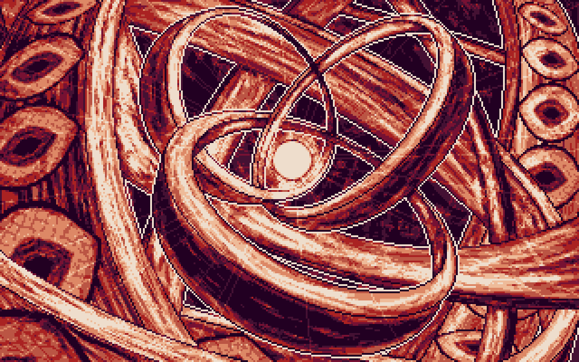

# (TODO: your game's title)

Author: (TODO: your name)

Design: (TODO: In two sentences or fewer, describe what is new and interesting about your game.)

Text Drawing: (TODO: how does the text drawing in this game work? Is text precomputed? Rendered at runtime? What files or utilities are involved?)

Screen Shot:

How To Play:

(TODO: describe the controls and (if needed) goals/strategy.)

Sources: 
Quicksilver font from https://www.dafont.com/quicksilver-3.font

This game was built with [NEST](NEST.md).

